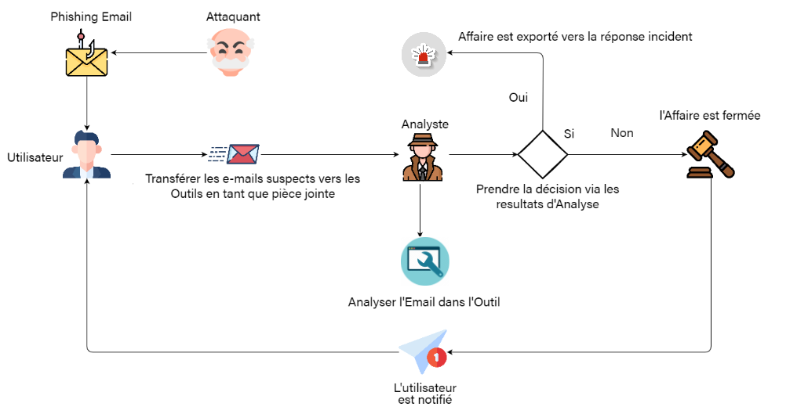

# Outil d'Automatisation de l'Analyse des Événement de Sécurité
Outil d'analyste SOC pour automatiser l'investigation et la validation d'éventuels indicateurs de compromission (IOC) et effectuer diverses tâches, notamment l'analyse des e-mails de phishing et la surveillance de la marque pour accélérer la réponse aux incidents.

L'objectif principal de l'utilisation de cet outil est d'automatiser autant de points de validation que possible effectués par l'équipe des opérations de sécurité d'entreprise tout en travaillant sur tout incident de sécurité, y compris la surveillance de la marque et une éventuelle attaque de phishing.

L'outil implémente également le cryptage (symétrique) afin que toutes vos clés API soient secrètes et sûres et ne puissent pas être manipulées tant que la clé de cryptage secrète n'est pas utilisée. Vous pouvez cependant modifier à tout moment vos clés API si vous avez accès à la clé de chiffrement.
<div>
  <p align="center">
     
  </p>
</div>
## CARACTÉRISTIQUES

Cet outil peut actuellement effectuer les tâches ci-dessous :
1. Vérification de la réputation des adresses IP, des domaines, des URL et des hachages de fichiers:
- [Virustotal](https://www.virustotal.com/gui/home/upload)
- [Abuse IP DB](https://www.abuseipdb.com/)
- [Alienvault OTXv2](https://otx.alienvault.com/)
- [Spyse](https://spyse.com/)
- [Phishtank](https://phishtank.org/)
- [URL Scan](https://urlscan.io/)
2. Analyse de la sécurité des e-mails ( Phishing Email Analysis ) :
- Analyser une URL de phishing
- Sandbox une pièce jointe malveillante présente dans un e-mail
- Analyse de l'en-tête des e-mails
- Directives pour effectuer une analyse des e-mails de phishing afin d'identifier les menaces .
3. Effectuer des recherches DNS, DNS inversé, WHOIS, ISP Lookups .
4. Décodage des URL Office365 Safelink, des URL encodées UTF-8 ou Base64 .
5. Exécution de File Sandboxing pour le fichier et sa réputation de hachage de fichier associée .
6. Effectuer une analyse de surveillance .

## COMMENT L'UTILISER
Le script est simple à comprendre et à utiliser.
Il peut être utilisé dans toutes ses fonctionnalités sans ouvrir le code source d'édition
1. Lors de l'exécution du script principal pour la première fois, il vous dirigera automatiquement vers le menu de configuration, où il vous sera demandé d'entrer les clés API des plates-formes utilisées dans l'outil .
2. Toutes les clés API sont gérées séparément dans le fichier de clés API. Les clés API sont également cryptées avec un cryptage à clé symétrique .
### 1. Commencer
Pour commencer à utiliser l’outil, il vous suffit de cloner ce référentiel.
```shell
git clone https://github.com/anasaffane/Outil-d-automatisation-d-analyse-des-evenements
```
Une fois cloné avec succès, changez de répertoire en Outil d'Automatisation de l'Analyse des Événement de Sécurité
### 2.Exigences
Installez toutes les dépendances via le fichier requirements.txt
```shell
  pip3 install -r requirements.txt
```
### 3. Exécution du script
Une fois les dépendances installées avec succès, l’outil est prêt à l’emploi. Exécuter le script en exécutant 
```shell 
python main_file.py
```
Une fois le script exécuté avec succès pour la première fois, vous serez invité à importer vos clés API dans l’outil. Vérifiez  requirements.txt l’étape numéro 3 pour générer les clés API et les importer pendant l’exécution.
## Auteur
[Anas Affane](https://github.com/anasaffane/)
